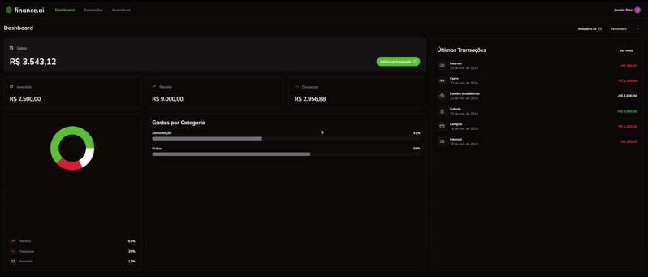

<div align="center">
  <h1>💰 Finance AI</h1>
  
  
  
  
</div>

## 📋 Descrição

Finance AI é uma aplicação de gerenciamento financeiro que permite aos usuários organizar suas finanças de forma simples e eficiente. A plataforma oferece funcionalidades para adicionar transações, visualizar gráficos e relatórios, e acessar diferentes planos de assinatura.

## 🚀 Tecnologias Utilizadas

- [Next.js](https://nextjs.org/)
- [Prisma](https://www.prisma.io/)
- [Shadcn](https://shadcn.dev/)
- [OpenAI](https://openai.com/)
- [Clerk](https://clerk.dev/)
- [Neon](https://neon.tech/)
- [Stripe](https://stripe.com/)
- [React Hook Form](https://react-hook-form.com/)
- [Zod](https://zod.dev/)
- [Tailwind CSS](https://tailwindcss.com/)
- [Husky](https://typicode.github.io/husky/)


## 🛠️ Pré-requisitos

- Node.js (versão 22.11.0)
- npm ou yarn
- Banco de dados PostgreSQL
- Conta no Clerk
- Conta no Stripe

## ⚙️ Como Executar

1. **Clone o repositório:**
```bash
git https://github.com/JonatanPaes/finance-ai.git
```

2. **Acesse a pasta do projeto:**
```bash
cd finance-ai
```
3. **Configure as variáveis de ambiente:**
```bash
cp .env .env.local
```
Preencha as variáveis necessárias do arquivo `.env.example` no arquivo `.env`

4. **Instale as dependências:**
```bash
npm install
# ou
yarn install
```

5. **Execute as migrações do Prisma:**
```bash
npx prisma migrate dev
```

6. **Execute Docker:**
```bash
docker-compose up -d
```
Caso prefira usar Docker, basta executar o comando e configurar a variável de ambiente `DATABASE_URL` no arquivo `.env`

7. **Execute o projeto:**
```bash
npm run start
# ou
yarn start
```

O projeto estará disponível em `http://localhost:3000`

## 📱 Preview da Aplicação

<div align="center">
  
</div>

## 📄 Licença

Este projeto está sob a licença MIT. Consulte o arquivo [LICENSE](./LICENSE) para mais detalhes.

## 👨‍💻 Autor

Feito por Jonatán Paes

[](https://www.linkedin.com/in/jonatanpaes182/)
